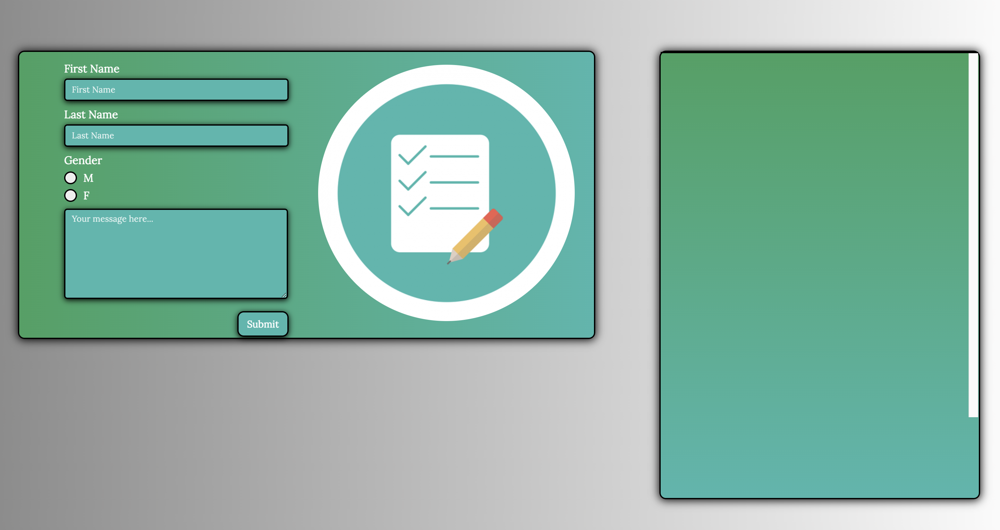
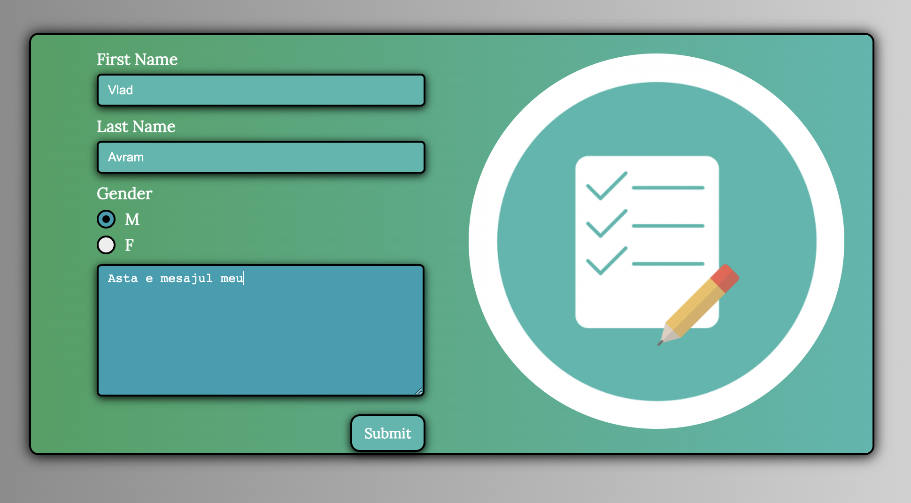
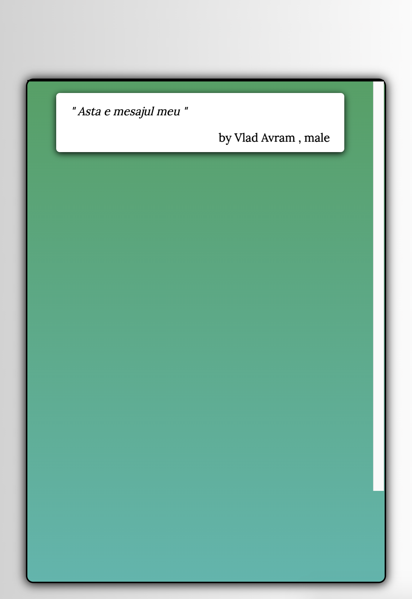
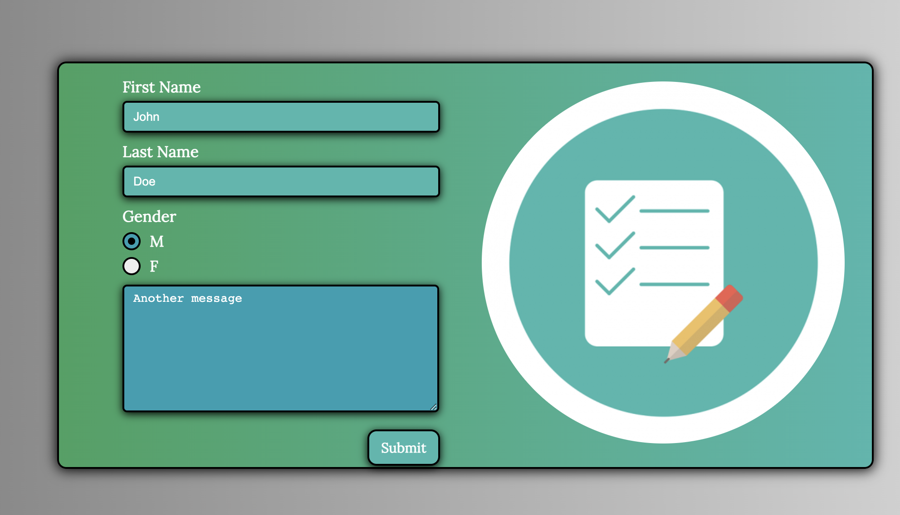
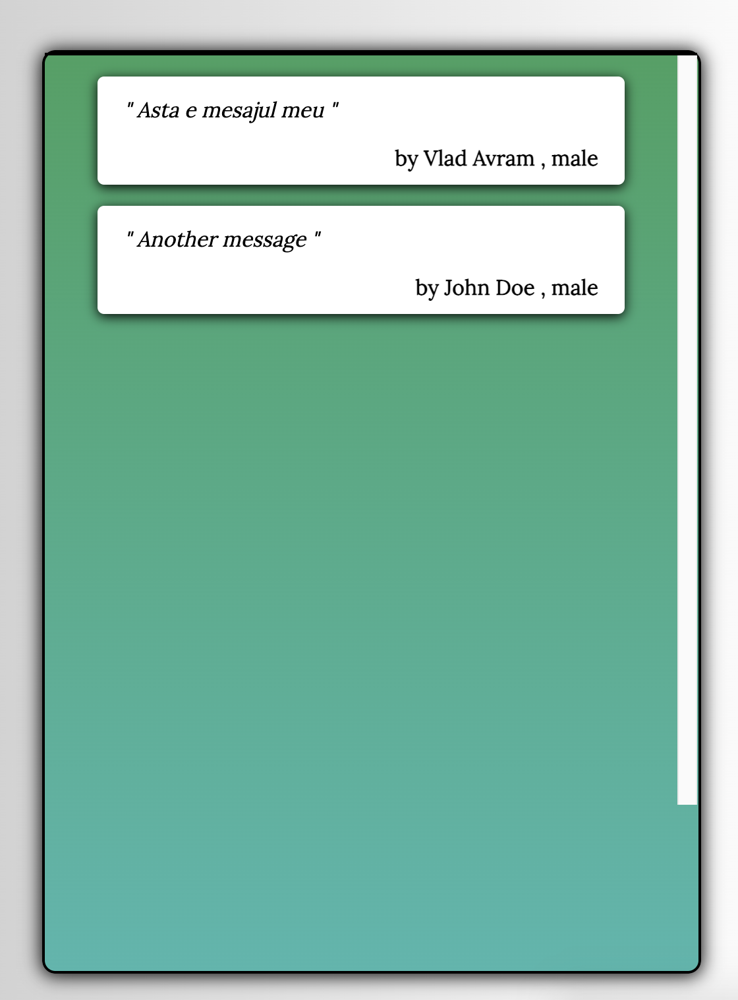

CREATE A DIFFERENT BRANCH FOR THE DIFFERENT HOMEWORK SECTIONS

SECTION 1. 
For this section you are going to use `movieObject` from index.js

    **1) Change the budget of the movie to be 0 to verify 
    console.log(movieObject.budget) //before it was 11000000

    2) Add new property `mustSee` with value true again to test it use console.log()

    3) Add a new method to that object `getGenres` that will return array with 
    only the names of the genres should display ['Adventure', 'Action', 'Science Fiction']
    ****TIP use this keyword remember the right way you can use `this` in a method

    4) Create a new variable that holds the production_companies

    5) Create a input in html that will represent a name, and a button. The input value 
    will be added into the existing object as a property called `movieDirector` when the Submit button will be clicked.
    

#SECTION 2. 
Create a blog form with 4 inputs. First Name, Last Name, Gender, Message. 
On the right side the message will be displayed with the name and the message as you will see in the design. 
Some kind of Twitter application. 
     
     First step: create the design nothing complicated.
     Second step: get the input elements in JS and get the values.
     Third step: when you click on the submit button add them to the right div.
     
     
     
     
     

Bonus*** If you click on any of the right side messages (tweets) will be deleted like I did on the live session.

